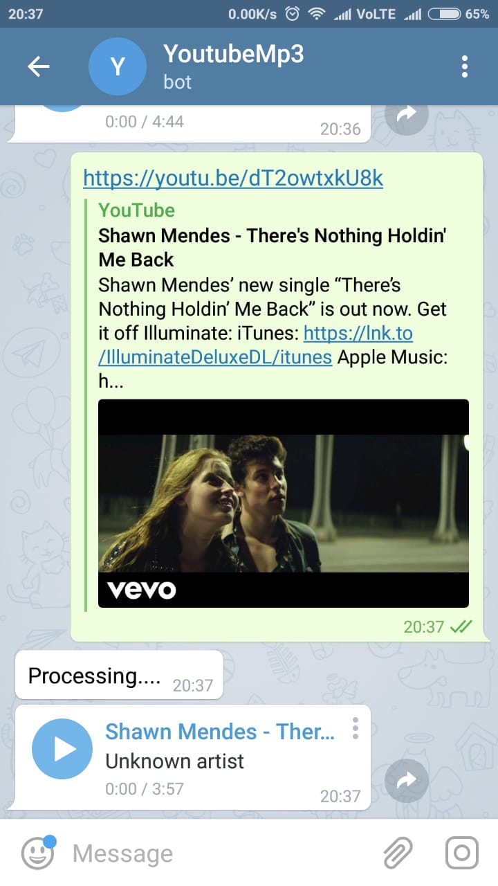

# WHAT?

This repository uses a Telegram bot to convert a youtube URL into `.mp3` audio.
Nodejs that acts as a server. After server is started it listens to the message received on the bot.

## RUN
 * Create a bot in the telegram and edit the token in the config file
 * `npm install` - to install the dependencies mentioned in `package.json` file.
 * `npm start`   - to start the server
 * 

## Library used
 * mentioned in `package.json` file.

## links

 * `https://github.com/mast/telegram-bot-api`
 * `http://mvalipour.github.io/node.js/2015/11/10/build-telegram-bot-nodejs-heroku`
 * `https://www.sohamkamani.com/blog/2016/09/21/making-a-telegram-bot/`

## BOT sample
   * 